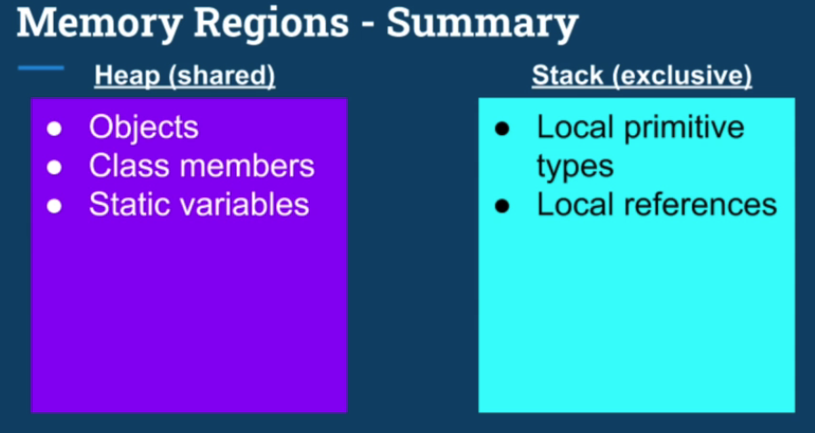

# multi-threading-java

<details>
<summary>1 Introduction</summary>

### Motiviation and OS fundamentals

- Why we need Threads?
    - Responsiveness (특히 User Interface에서 더 치명적임) by concurrency = multitasking
    - Performance(짧은 시간안에 더 많은 작업 처리 가능) by parallelism
- Multithreading caveat(경고)
    - Multithreaded programming은 근본적으로 싱글쓰레드 프로그래밍과 다름

- What is thread?
    - 컴퓨터를 켜면 OS가 디스크에서 메모리로 올라옴
    - 우리가 한 어플리케이션을 실행시키면 마찬가지로 디스크에서 메모리로 인스턴스가 생성됨
    - 위 인스턴스는 프로세스/context of application이라고도 불림
    - 이 프로세스는 다른 프로세스와 완전히 독립적임
    - Files, Data(Heap), Code, Main Thread(Stack, Instruction Pointer)로 구성됨
    - 쓰레드 단위에서는 Stack과 IP를 뺀 나머지는 공유됨
    - Stack은 로컬변수들이 저장되고, 함수에 전달되는 메모리 영역/ IP는 수행할 다음 instruction 주소


### OS fundamentasl part2

- What is context switch?
    - 프로세스는 다른 프로세스와 독립적으로 수행됨
    - 프로세스는 하나 이상의 스레드를 가지며, 스레드들은 cpu를 점유하기 위해 경쟁함 
    - 그래서 context switch는 스레드 1 수행 -> 스레드 1 멈춤 -> 스레드 2 수행
    - price of multitasking
    - 스레드가 너무 많으면 -> trashing = 실제 작업보다 스레드 매니징에 시간이 더 쓰임
    - 스레드 간의 sw가 프로세스 간의 sw 보다 싸다

 - Thread scheduling
    - First come first serve -> 수행시간이 긴 스레드가 먼저 오면 stravation 발생가능
    - Shortest Job First -> 수행시간이 짧은 스레드가 계속 오면 수행시간 긴거 수행 못함
    - 실제 os에서는 dynamic priority를 사용함 (User Interface UI 에는 우선순위 부여, Stravation 방지)

- Thread vs Process
    - thread
        - if task share a lot of data
        - faster
        - switching is faster
    - process
        - security and stability are higher importance
        - tasks are unrelated

</details>

<details>
<summary>2 Threading fundamentals - Thread Creation</summary>

### Thread Creation 1

- Thread.sleep() 함수는 OS로 하여금 현재 쓰레드를 스케줄하지 않도록 지정(loop를 돌거나 하는 것이 아님!!)
    - CPU 점유 안 함

- threadInstance.setPriority(1..10) 를 통해 우선순위를 설정할 수 있음

- thread.setUncaughtExceptionHandler()를 통해 예외처리 핸들러 등록가능

### Thread Creation 2

- Thread를 상속하는 클래스를 만들고, run() 함수를 구현하는 방식으로도 쓰레드를 생성할 수 있다.

</details>

<details>
<summary>3 Threading fundamentals - Thread Coordination</summary>

### Thread Termination & Daemon Threads 1

[Thread termination]
- 쓰레드는 리소스 점유함 -> 메모리와 커널 리소스. 만약 CPU를 쓰게 되면 CPU cycles과 cache memory 까지
- 만약 쓰레드가 끝나면, 리소스 정리할 필요가 있음
- 쓰레드가 이상하게 동작하면, 멈출 필요가 있음
- **만약 수행중인 쓰레드가 존재하면 application은 멈추지 않음**

[Interrupt 하는 방법]
- interrupt signal을 손수처리하는 코드 추가
- InterruptedException 던지는 method 실행

[데몬 쓰레드]
- 종료되도 상관없는 쓰레드. 애플리케이션동작에 영향을 주지 않기를 원할때
- gracefully 하게 종료되지 않아도 되는 쓰레드


### Joining Threads

[Why do we need it?]
- 다른 쓰레드는 독립적으로 동작함
- 쓰레드의 수행은 out of control 임

[How?]
- 쓰레드가 loop를 돌면서 다른 쓰레드가 끝났는지 계속 체크한다 -> 비효율적임
- 좋은 방법은 쓰레드가 go to sleep 하는거임
    - 이를 위해 join을 쓰면 댐


</details>


<details>
<summary>4 Performance Optimization</summary>

[Peformance in multithreading]
- Latency - the time to completion of a task. Measured in time units.
- Throughput - the amount of tasks completed in a given period. Measured in tasks/time unit.

[Latency]
1. 태스크가 single core 에서 T의 시간이 걸리는 작업일때
2. 태스크를 N개로 쪼개어 subtask로 만들고, 병렬적으로 수행한다면
3. T/N 으로 Latency를 줄일 수 있다

[N?]
- 그렇지만 일반적으로 N은 코어의 개수이다/ 만약 코어의 개수보다 많게 N을 설정하면 역효과가 남. 남은 하나의 쓰레드가 컨텍스트 스위칭을 유발하면서 캐시성능 저하, 추가적인 메모리 점유를 일으킬것임
- 그리고 N = 코어의 개수 는 IO 블로킹과 같은 인터럽션이 없을때를 가정한것임. (다른 CPU를 점유하는 프로세스가 없어야 댐)
- 또한 대부분의 컴퓨터는 HyperThreading을 지원함. 이는 물리적인 코어가 동시에 2개의 쓰레드를 동작할 수 있게 하는 기능. 

[Inherent cost of Parallelization and Aggregation]
- 고려해야 되는 코스트
    - 태스크를 나누는 코스트
    - 쓰레드 생성하고 쓰레드에게 태스크 할당하는 코스트
    - 쓰레드 시작하고, 스케줄되는 시간
    - 마지막 쓰레드가 끝나고 시그널을 보내는 시간
    - aggregating 쓰레드가 동작하는 시간

- 본 태스크의 수행시간이 짧은 경우에는 태스크를 분할 하는게 latency가 더 길 수 있다.

[Can we break any task into subtasks?]
- 아니다....
- 독립적으로 수행되는 코드조각으로 이루어져 나눌 수 있는 태스크/순차적으로 실행되어야하기에 나눌 수 없는 태스크/ 위 2경우가 혼재되어 있는 태스크

[Optimizing for Throughput]
- throughput은 정의한 시간내에 완료한 작업의 수이다. tasks/time unit
- 방법 1. breaking tasks into subtasks
    - latency = t/n
    - throughput = n/t (기존 1/t 보다 성능개선)
    - 그러나 실제적으로 < n/t 로 봐야댐. 추가적인 계산요소들이 있어서. (이전에 말했듯이 태스크 나누는 코스트, 쓰레드 생성 할당하는 코스트 등등..)
- 방법 2. Running tasks in Parallel
    - 각 태스크를 다른 쓰레드에 할당하는 것.
    - throughput = n/t
    - 이 경우에는 실제적으로 n/t와 유사할 것임

[Thread pooling]
- thread pool에 쓰레드 미리 생성해놓고 필요할 때 꺼내쓰는 기술

[QUIZ]  
We are running an HTTP server on a single machine.  
Handling  of the HTTP requests is delegated to a fixed-size pool of threads.  
Each request is handled by a single thread from the pool by performing a blocking call to an external database which may take a variable duration, depending on many factors.  
After the response comes from the database, the server thread sends an HTTP response to the user.  
Assuming we have a 64 core machine.  
What would be the optimal thread pool size to serve the HTTP request?  

-> blocking call들은 CPU 리소스를 사용하지 않기에, 코어의 개수인 64개보다 더 많은 쓰레드를 할당하여 throughput을 최적화 할 수 있을것이다. 

</details>

<details>
<summary>5 Data sharing between Threads</summary>

[Stack?]
- 함수들이 호출되고, 인자들이 건네지고, 지역변수가 저장되는 메모리영역
- stack + instruction pointer 는 각 쓰레드의 실행상태이다
- 함수들이 호출될때마다 stack frame이 쌓인다

[Stack Properties]
- 쓰레드가 생성되면 할당됨
- 스택의 크기는 플랫폼에 따라 고정되어 있음
- 스택오버플로우 예외는 함수호출이 너무 많을때 발생할 수 있음

[Heap]
- Objects, member of classes, Static variables 들이 할당 될 수 있음
- GC에 의해 관리됨. Object들은 참조하는 곳이 있는한 존재함
- member of classes들은 부모 object들이 존재하는 한 같이 존재함
- static variable은 영원히 존재함

[object vs references]
- references 는 stack에 할당될 수 있고, 클래스의 멤버라면 heap에 할당될 수 있음
- object는 heap에만 할당될 수 있음

[Stack vs Heap]


[Resources?]
- variables
- data structure
- file or connection handles
- message or work queue
-> heap에 할당되는 모든 것들

[Why we need Resource sharing]
- work queue 가 존재하고, 다수의 스레드가 queue에서 task를 가져가는 구조일때
- 다수의 http request thread가 db에 조작을 가하는 환경에서


[Challenge of multithreaded programming]
- resource를 조작하는 atomic 하지 않은 연산들을 여러 스레드가 수행하다 보면 기대하지 않는 결과를 얻을 수 있음 

</details>

<details>
<summary>6 Concurrency Challenge</summary>

[Critical Section]
- 둘 이상의 쓰레드가 동시에 접근해서는 안되는 리소스에 접근하는 코드들을 말함

[Synchronized - monitor/lock]
- java의 synchronzied 문법을 사용하여 메소드 혹은 코드 영역에 하나의 쓰레드만 접근하도록 설정할 수 있다.
- 메소드에 사용하게 되면 그 클래스가 가지는 모든 synchronzied 메소드에 하나의 쓰레드만 접근가능하다.
- 코드영역에 사용하게 되면 lockingObject를 아규먼트로 넣어줘야 함
- 위 기법을 모니터라함
- 그리고 동기화 블록은 재진입이 가능함.

[Atomic Operation?]
- all reference assignments 
- all assignment to primitive type except long and double
    - long, double은 64비트라 보장할 수 없음 -> volatile 키워드를 붙이면 원자성이 보장됨

[Race Condition]
- 둘 이상의 스레드가 하나의 공유자원에 접근할때, 최소 하나의 스레드가 공유자원을 수정하려고 하는 상황임
- 이때 스레드 스케줄링에 따라 부정확한 결과값을 도출할 수 있는 상황을 일컫는 말
-> 이를 위한 해결방법은 critical section을 찾고 보호하는 것임 

[Data race]
- 컴파일러와 CPU는 인스트럭션수행순서를 성능 최적화를 위해 조절하는 경우가 있다.
- 논리적인 정합성에 어긋나지 않는 방향으로 조절함
- 아래 코드는 순서대로 실행될것임
```
public void someFunction() {
    s = 1;
    x = s + 2;
    z = x + 4;
}
```
- 하지만 아래 코드는 조정될 수 있음
```
public void increment() {
    x++;
    y++;
}

public void decrement() {
    x--;
    y--;
}
```
- 그래서 이를 피하기 위해서는?
    - Synchronized 키워드 사용하기 -> 하지만 race condition이 아닌 상황인데 쓰기 좋지 않음. 멀티쓰레드의 장점을 포기해야하기에 비효율적임
    - 그래서 volatile을 쓰자  [volatile 설명하는 좋은 글](https://jenkov.com/tutorials/java-concurrency/volatile.html)


[Locking]
- Coarse-Grained  
    - 모든 리소스에 하나의 락
    - 구현이 간단하지만, 비효율적이다. 
    - 하나의 리소스에 접근할때, 비록 다른 리소스에 대한 락이 잡혀있더라도 접근못함..
- Fine-Grained
    - 하나의 리소스에 하나의 락
    - 더 병렬적으로 CPU 활용 가능... 그러나 DEAD LOCK 발생가능!!

[Dead Lock]
- 스레드1이 락1을 잡고 있고, 스레드2가 락2를 잡고 있을때, 각 스레드가 서로의 락을 원할때 데드락이 발생함

[Dead Lock Condition]
- Mutual Exclusion : 하나의 스레드만 리소스에 접근 가능함
- Hold and Wait : 최소 하나의 스레드가 리소스를 가지고 있으며 다른 리소스를 기다리고 있음
- Non-preemtive : 리소스는 스레드가 가지고 있을때 뺏을 수 없음
- Circular Wait : 최소 2 스레드가 리소스를 가지면 다른 리소스를 기다리고 있음 

[Solutions to Dead Lock]
- Avoid circular wait
    - 락을 얻는 과정의 순서를 고정한다!
    - 좋은 방법이지만, 락이 많은 경우 적용하기 힘들 수 있음
- watchdog를 이용해 deadLock 감지하기
- thread Interruption(not possible in Synchronized)
- try lock(not possible in Synchronized)

</details>


<details>
<summary>7 Advanced Locking</summary>

[ReentrantLock]
- 객체에 적용된 Synchronized 키워드처럼 동작함
- 명확한 락킹과 언락킹이 필요함

```java

public void method() {
    lockObject.lock();
    ...
    lockObject.unlock();
}
```
- 단점은 언락킹 하는것을 까먹는다면, 데드락의 원인이 됨
    - 그래서 위 단점을 막기 위해 try-finally 구문에서 finally 블록에서 언락킹하는 패턴이 있음

- 테스트를 위해 많은 함수들을 지원함
    - getQueuedThread()
    - getOwner()
    - isHeldByCurrentThread()
    - isLocked()
- 락의 공정성을 보장하는 기능도 제공
    - 하지만 이 기능은 throughput을 악화시킬 수 있음
- lockInterruptibly() 기능
    - 일반 lock() 의 경우에는 다른 스레드가 락을 점유하고 있는 경우, 스레드가 중단됨.
    - 그래서 interrupt를 호출해도 소용없음
    - 그러나 lockInterruptibly() 는 예외를 발생시킴
    - 이 기능을 통해 정지된 스레드의 종료전에, 청소하기 용이함

- tryLock() 기능
    - 락 점유가능하다면, 참을 반환하고 락을 점유함
    - 락 점유불가능하다면, 거짓을 반환하고 중단되지 않고 다음 명령어로 넘어감
    

[ReentrantReadWriteLock]
- Race Condition은 다수의 스레드가 자원을 공유하며, 최소 하나의 스레드가 리소스를 변경할때 발생함
- 이의 해결방법은 Mutual Exclusion
    - 그렇지만, 읽기만 하는 스레드들을 모두 Mutual Exclusion 하면 비효율적임
- 그래서 읽기만 하는 작업이 많다면, ReadWriteLock을 사용하자
    - readLock 은 읽기만 하는 스레드는 모두 획득 가능, writeLock이 점유중이면 획득 불가
    - writeLock은 하나의 스레드만 획득 가능


</details>

<details>
<summary>8 Inter Thread Communication </summary>


[Semaphore]
- can be used to restrict the number of users to a particular resources or a group of resources
    - 이에 비해 락은 리소스당 하나의 유저로 제한함
- 세마포어는 초기에 선언될 때, 허용할 개수를 아규먼트로 받으면 선언됨
- 선언된 개수 만큼 각 스레드가 얻을 수 있으며, 한번에 하나 이상의 개수를 얻을 수 있음. release 할 때도 하나 이상의 개수를 release 할 수 있음


[Binary Semaphore]
- 이는 락과 유사함

[Semaphore vs Lock]
- semaphore는 소유자 스레드 라는 개념이 없음. 다수의 스레드가 얻을 수 있기 때문
- 같은 스레드가 semaphore를 여러번 얻을 수 있음
- semaphore는 어느 스레드든 release 할 수 있음


[Producer vs Consumser]
```java
Semaphore full = new Semaphore(0);
Semaphore empty = new Semaphore(1);
Item item = null;

void produce() {
    while(true) {
        emtpy.acquire();
        item = produceNewItem();
        full.release();
    }    
}

void consume() {
    while(true) {
        full.acquire();
        consume(item);
        empty.release();
    }
}

``` 


[스레드간 통신]
- Thread.interrupt()
- thread.join()
- Semaphore

[Semaphore as Condition Variable]
- acquire() 는 허용 개수가 0 초과인지 체크하는 것과 같음
- 0 이하라면 스레드는 sleep
- 다른 스레드가 release 하면, 스레드는 다시 한번 허용개수가 0 초과인지 체크하고, 조건에 부합한다면 다음 instruction 수행

[Condition Variables]
- condition variable은 항상 lock 과 관련이 있음
- condition variable을 활용한 Producer Consumer 예제
```java
Lock lock = new ReentrantLock();
Condition condition = lock.newCondition();
String userName = null, password = null;

void produce() {
    lock.lock();
    try {
        while(userName == null || password = null) { // 4. 조건 확인하고, 나머지 진행 
            condition.await(); // 1. 이때 unlock 하고, sleep
        }
    } finally {
        lock.unlock();
    }
    doStuff();
}

void consume() {
    lock.lock();
    try {
        userName = userTextBox.getText();
        password = passwordTextBox.getText();
        condition.signal(); // 2. produce 스레드 깨움
    } finally {
        lock.unlock(); // 3. unlock
    }
}


```

- void await() => unlock lock, wait until signalled
- void signal() => wakes up a single thread, waiting on the condition variable
    - 만약 기다리고 있는 condition variable이 없으면 아무것도 안함/ 세마포어와의 차이점
- void signalAll() => 기다리고 있는 모든 스레드에게 신호를 보냄


[Object as Condition Variable]
- 모든 자바 클래스는 Object 클래스를 상속하므로, 어떤 객체라도 condition variable로 사용할 수 있음
- wait() / notify() / notifyAll()

```java

public class MySharedClass {

    private boolean isComplete = false;
    public void waitUntilComplete() {
        synchronized(this) {
            while(isComplete == false) {
                this.wait();
            }
        }
    }
    public void complete() {
        synchronized(this) {
            isComplete = true;
            this.notify();
        }
    }

}

```

</details>

<details>
<summary>9 Lock Free Algorithm </summary>

[Problem of Lock]
- Dead Lock 
    - 프로그램을 완전히 정지시킬 수 있음
    - 락이 많아질 수록 dead lock의 발생 확률이 올라감
- Slow Critical Section
    - 다수의 스레드가 하나의 락을 사용하는 경우, 만약 하나의 스레드가 락을 오래 점유하면 다른 스레드들의 속도가 느려짐
- Priority Inversion
    - 낮은 우선순위를 가지는 스레드가 락을 점유하고 있는 상황에서, 스케줄 아웃됨 -> 높은 우선순위를 가지는 스레드가 락을 요청하는 상황이면, 스레드 진행이 안됨...
- Thread not releasing a lock
    - 스레드가 락을 release 하지 않고 죽어버린 상황...
    - 복구 불가능한 상황임
- Performance
    - 락을 요청하고, 점유하는 오버헤드
    - 대부분의 경우에는 인지하지 못할 정도로 작은 연산이지만, 실시간 응답이 중요한 프로그램의 경우에는 중대할 수 있다

[Lock Free Techniques]
- 락이 필요한 이유는?
    - 다수의 스레드가 공유자원에 접근하는 경우
    - 최소 하나의 스레드가 자원을 수정하려고 함
    - non atomic operation
- atomic operation 조건을 만족하면 된다!!
    - 단일 하드웨어 명렁어를 만족하게 하자
- atomic operation
    - read, assignment on all primitive types (except long, double)
    - read, assignment on all references
    - volatile long and double
    - AtomicX Classes...

[Atomic Integer]
```java
int initialValue = 0;
AtomicInteger atomicInteger = new AtomicInteger(initialValue);

atomicInteger.addAndGet(5);
atomiceInteger.getAndAdd(5);

```

- 장점은 단순함/락 불필요/ race condition or data race 없음
- 단점은 위 operation 자체만 atomic 함

- 결론은 동시성문제에서 좋은 해결책이지만, 필요한 경우에만 사용해야함. 싱글스레드 환경에서는 비효율적임!


[AtomicReference]
- compareAndSet(expectedValue, newValue)
    - 현재 값과 expectedValue가 같다면 newValue로 업데이트, 아니라면 무시됨
    - 하나의 하드웨어 오퍼레이션으로 컴파일 됨
    - 많은 atomic operation이 위의 연산을 내부적으로 활용함
    

</details>

<details?>
<summary>10 Threading models for High Performance IO</summary>

[블로킹 작업]
- 락을 활용하는 경우, critical section에 하나의 스레드만 접근할 수 있기에, 다른 스레드는 블로킹 된다.
    - 이는 performance 측면에서 큰 단점임
- 이런 단점으로 인해, 위에서 lock-free algorithm등을 살펴봤음
- 이번에는 블로킹 작업의 일종인 blocking IO를 알아볼것임

[IO?]
- CPU는 메모리에 언제든지 직접 접근이 가능하기에, OS의 개입없이 메모리에 데이터를 읽고 쓸 수 있음
- 그렇지만 모니터, 키보드, hdd, network card 등에는 직접 접근이 불가능함
    - 위의 장치 작동이 완료되고 준비가 되기 전까지 CPU 할 일 없음. 다른 작업 수행 가능
    - 준비 완료되면 interrupt가 발생함
    - 장치 데이터를 CPU가 읽어들이거나 쓰는데 OS나 드라이버가 활용됨
- DMS? 위의 장치들이 바로 메모리에 쓰거나 읽는 권한

[Thread pooling]
- 스레드 풀을 유지함으로서, 스레드를 생성하고 시작하고 종료하는 오버헤드를 줄일 수 있음
    - 그렇지만 블로킹호출을 컨텍스트 내에 포함하지 않아야함..
    - 예를 들어, 싱글코어이고, 스레드 풀의 스레드 개수가 1개인 상황에서, IO bound Application이라면, 대부분의 시간에 CPU가 idle 임
    - 새로 들어오는 요청은 network card queue에 쌓임

[Multithreaded example]
- 멀티 스레드 환경에서도 IO bound application은 문제가 됨
- 스레드 수가 고정되어 있는 상황에서, IO가 긴 작업을 스레드가 시작하게 되면, 호출가능한 스레드 수가 줄어들게 되어, 전체적이 성능에 영향을 줌...

[Observation]
- 블로킹 호출을 포함하는 경우, 스레드 수 = 코어수 인 상황에서
    - 최고의 성능과 CPU 활용을 보여주지 않는다..
- 소수의 블로킹 호출을 포함하더라도, 전체적인 성능에 영향을 준다...


[Thread Per Task Model]
- 요청마다 스레드를 생성함
- 문제점 => 스레드는 비싼 자원이다.../스레드는 스택 메모리와 다른 자원을 점유함/문맥교환으로 인한 성능 저하(Threadshing)

</details>
